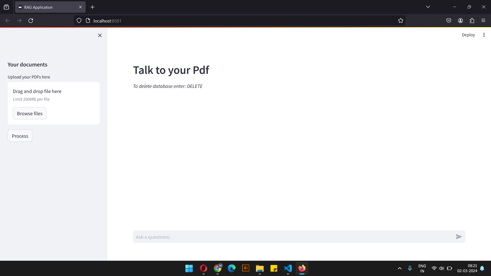
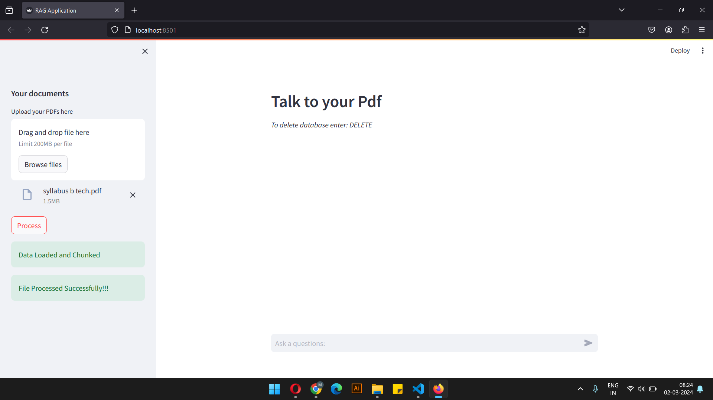

# RAG-application

Welcome to the RAG Application repository! This is a Streamlit application for interacting with a retrieval-augmented generation (RAG) model. The application allows users to ask questions and receive answers, with the ability to provide context for more accurate responses.




## Introduction

The RAG Application leverages cutting-edge natural language processing (NLP) techniques to provide an intuitive and interactive interface for accessing information from documents. It combines the power of Hugging Face's model hub with the efficiency of ChromaDB to deliver accurate and context-aware responses to user queries.

## Files

- `app.py`: This is the main Python script that defines the Streamlit application and its functionalities. It handles user interactions, document processing, and model invocations.
- `data_to_db.py`: This script is responsible for loading PDF documents, chunking them, creating a database of vectors, and returning a retriever object.
- `model_functions.py`: This script contains functions for defining prompts, processing model outputs, and updating conversation history.
- `requirements.txt`: This file lists all the Python packages required for running the application.
- `README.md`: This README file provides an overview of the project, installation instructions, usage guidelines, and other relevant information.

## Installation

1. Clone this repository:

    ```bash
    git clone https://github.com/your_username/rag-application.git
    cd rag-application
    ```

2. Install dependencies:

    ```bash
    pip install -r requirements.txt
    ```

3. Set up environment variables:

    - Ensure you have a valid Hugging Face API token and set it as an environment variable named `HUGGINGFACEHUB_API_TOKEN`.
  
4. Run the application:

    ```bash
    streamlit run app.py
    ```
## Working

The application works by utilizing Streamlit to create an interactive user interface. It integrates with Hugging Face's model hub to access a retrieval-augmented generation (RAG) model for answering user questions. PDF documents uploaded by the user are preprocessed and stored in a database using ChromaDB. Users can then ask questions in the chat input, and the application retrieves relevant information from the stored documents and provides answers through the RAG model.

## Usage

1. Upload PDF documents using the provided file uploader.
2. Click the "Process" button to preprocess and store the documents in the database.
3. Ask questions in the chat input and receive responses from the RAG model.

## Contributing

Contributions are welcome! Please fork this repository and create a pull request with your changes. For major updates, please open an issue first to discuss potential changes.

## License

This project is licensed under the MIT License - see the [LICENSE](LICENSE) file for details.


